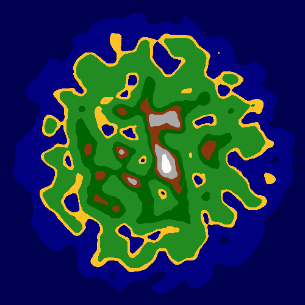
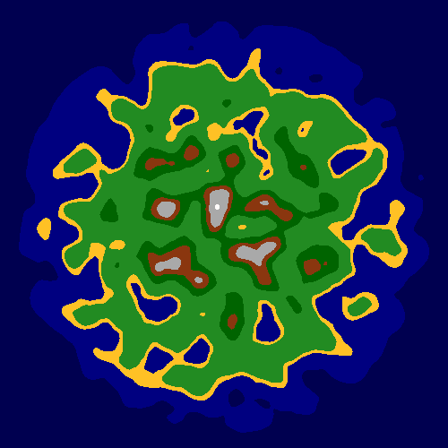
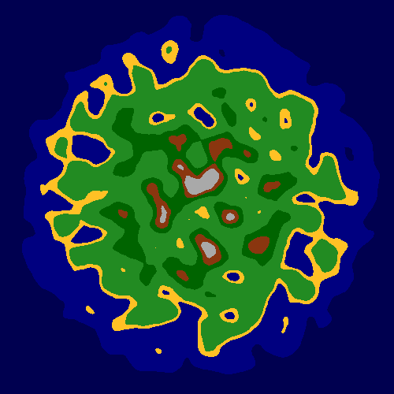
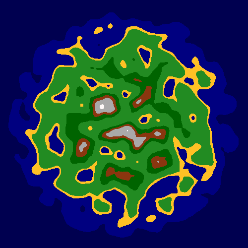

# Usage
### Simplex noise version
Run `main.py`, and take it from there

# Future planned development (soon &trade;)
* **Generate landscapes with Voronoi Diagrams**
* More detailed enviroment

# Examples

# Sources
- [Making maps with noise functions
from Red Blob Games](https://www.redblobgames.com/maps/terrain-from-noise/)

- [Fantasy Maps for fun and glory](https://azgaar.wordpress.com/)
